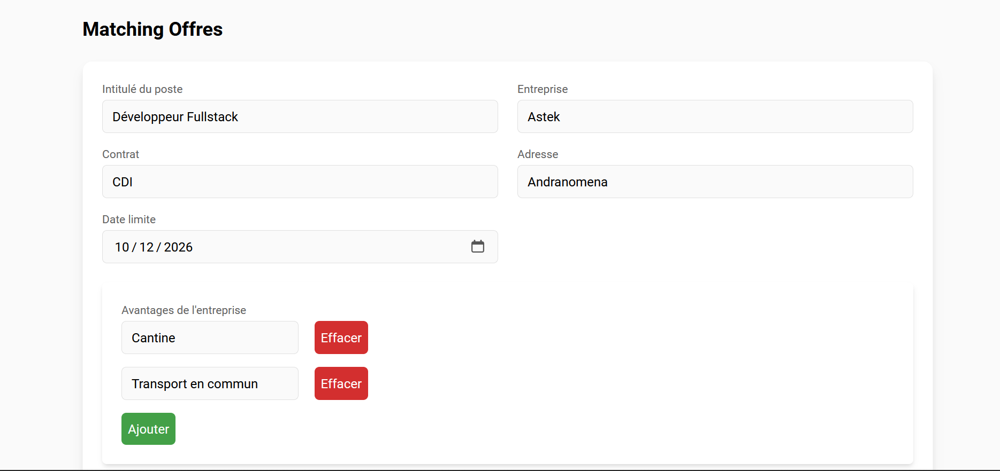
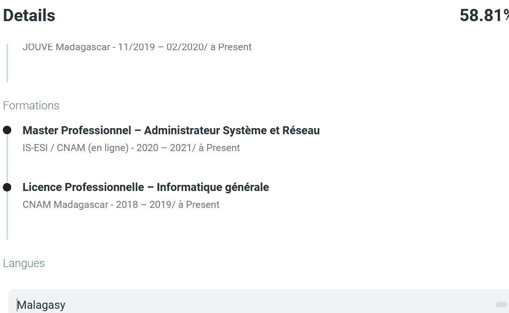
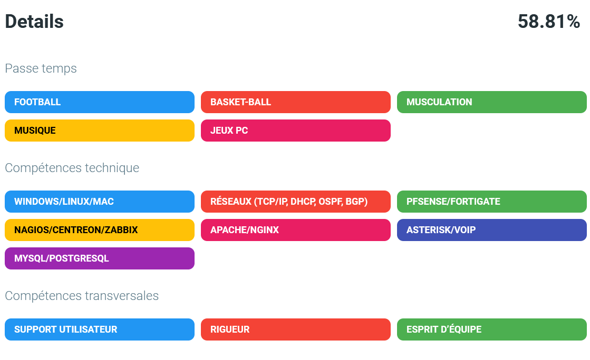

# Partie I :  Collecte automatique des offres d’emploi, Matching Offre => CV – Portal Job Madagascar et Offre emploi (par Erico et Fitia)

-Portal Job : https://www.portaljob-madagascar.com/emploi/liste

-Offe emploi: https://offre-emploi-madagascar.com/newest-jobs-2/jobs

## Description

Cette partie a pour but de **scraper les offres d’emploi publiées sur le site [Portal Job Madagascar](https://www.portaljob-madagascar.com)** afin d’extraire automatiquement les informations importantes (titre, entreprise, profil, missions, référence, etc.) et de les **convertir en un fichier JSON structuré**.

---

## Technologies utilisées

- **Python 3.x**
- **BeautifulSoup4** – pour extraire les informations HTML
- **Requests** – pour télécharger les pages du site
- **JSON** – pour stocker les résultats
- **Virtualenv** – pour isoler l’environnement Python

---

## Étape 1 : Création et activation de l’environnement virtuel

```bash
# 1. Créer un environnement virtuel
python -m venv venv

# 2. Activer l’environnement (selon le système)
# Sous Windows :
venv\Scripts\activate
# Sous macOS / Linux :
source venv/bin/activate


## Webscrapping Offre_emploi

1. Exécutez le script :
```bash
python offre_emploi.py
```

2. Le script affichera les données de chaque offre au fur et à mesure.
3. Toutes les offres seront enregistrées dans offre_emploi.json.

## Étape 2 : Installation des dépendances
```
pip install -r requirements.txt
```
## Étape 3 : Scraper les pages du site Portal Job
- Le script parcourt les 50 premières pages du site :
```
    for page in range(1, 51):
    url = f"https://www.portaljob-madagascar.com/emploi/liste/page/{page}"
```
- Chaque page est analysée avec BeautifulSoup :
```
soup = BeautifulSoup(response.text, "html.parser")
details = bloc_principal.find_all("div", class_="item_detail")
```
## Étape 4 : Transformation en texte (colonne contenu)

Une fonction offre_to_text() a été créée pour transformer chaque offre en texte compact, utile pour un futur traitement NLP ou embedding :

## Aperçu du code
```
def offre_to_text(offre_json):
    champs = []
    champs.append(f"Titre: {offre_json.get('titre', 'Non précisé')}")
    champs.append(f"Entreprise: {offre_json.get('entreprise', 'Non précisée')}")
    champs.append(f"Contrat: {offre_json.get('contrat', 'Non précisé')}")
    champs.append(f"Date limite: {offre_json.get('date_limite', 'Non précisée')}")
    if offre_json.get("profil"):
        champs.append("Profil: " + ".".join(offre_json["profil"]))
    result = ", ".join(champs)
    return {"contenu": result}


async def match_cvs_for_offre(offre_id, top_n=None):
    print("matching")
    _require_model_ready()
    model = _get_model()

    offre = await offreService.getOffreById(offre_id)
    print("Offre ok")
    cvs = await candidatService.getAllCandidats()
    print("Candidat ok")

    # Encodage
    print("Encodage")
    offre_embedding = model.encode(offre.contenu, convert_to_tensor=True)
    cv_texts = [cv.contenu for cv in cvs]
    cv_embeddings = model.encode(cv_texts, convert_to_tensor=True)

    # Similarités
    print("Similarités")

    scores = util.cos_sim(offre_embedding, cv_embeddings)[0]

    # Tri décroissant
    print("Tri décroissant")
    
    best_idx = scores.argsort(descending=True)

    results = []
    print("Best")

    for idx in best_idx:
        score_val = float(scores[idx])
        if score_val != 0:  
            candidat = cvs[idx]
            results.append({
                "candidat": candidat,
                "score": score_val,
            })
        else:
            break  

    
    if top_n is not None:
        return results[:top_n]
    return results

```


## Étape 6 : Fichiers générés et réexporte le tout en JSON

```
import json
with open("offres_portaljob.json", "w", encoding="utf-8") as f:
    json.dump(resultats, f, ensure_ascii=False, indent=4)
```

- Les résultats sont stockés dans une liste puis sauvegardés au format JSON. **(+6524 Offres)** Transformation en texte
```
offres-portal-Job-6524.json
offre_emploi_paginated.json
```

## Gestion des erreurs

- En cas d'erreur lors de la récupération des détails, le script affiche un message et saute l'offre concernée.
- En cas d'autres exceptions, le script continue avec l'offre suivante.


## Remarques

- Une pause d'une seconde (time.sleep(1)) entre les requêtes est ajoutée pour ne pas surcharger le serveur.
- Vérification que le scraping respecte les conditions d'utilisation du site.

## lien repository Webscrapping: https://github.com/ericonomena/webscrappingTalentMatch.git


## Vue côté utilisateur (recruteur)
Les utilisateurs peuvent accéder à une fonctionnalité permettant de trouver des candidats correspondant à leur offre. Ils remplissent un formulaire pour l'offre. Une fois le formulaire vérifié et envoyé, le système **analyse des candidats par rapport à l'offre** et **affiche une liste de recommendations de candidats**, triées par **score**.




## Fonctionnement côté interne
Le système enregistre d'abord l'offre concerné pour enrichir les données. Ensuite il passe par l'encodage du contenu de l'offre et des cvs. Puis il calcule les similarités entre l'offre et les cvs, et procède au tri décroissant pour les scores de similarités plus élevées et propose aux utilisateurs les top 10 des candidats recommandés.


# Partie II : Fonctionnalité : Collectes CV, Matching CV → Offres ( par Mélodie et Finaritra)

## 1. Vue côté utilisateur

Les utilisateurs peuvent accéder à une fonctionnalité permettant de trouver des offres correspondant à leur profil.  
Deux options s’offrent à eux :

1. **Remplir manuellement un formulaire** contenant les informations principales de leur CV (informations personnelles, expériences, formations, compétences, etc.)  
2. **Uploader leur CV** au format **PDF** ou **DOCX**. Dans ce cas, le système extrait automatiquement les informations du document et **pré-remplit le formulaire**.

Une fois le formulaire vérifié et envoyé, le système **analyse le profil de l’utilisateur** et **affiche une liste d’offres correspondantes**, triées par **pertinence**.

---

## 2. Fonctionnement côté interne

Lorsqu’un utilisateur choisit d’uploader un fichier **PDF** ou **DOCX** de son CV :

1. Une **API d’extraction de texte** transforme le document en texte brut.  
2. Ce texte est ensuite envoyé à un **modèle LLM (Gemini)**, qui le convertit en une **structure JSON normalisée** correspondant au schéma `Candidat`.  
3. La structure générée est **validée** via un modèle **Pydantic** pour garantir la cohérence et le bon typage des données.  
4. Une fois la structure validée, un **API de matching** est appelée.  
   Cet API compare les informations du candidat (compétences, expériences, secteur d’activité, etc.) avec les offres disponibles.  
5. Le résultat renvoyé est une **liste d’offres triées** selon un **score de similarité**, du plus pertinent au moins pertinent.  

Le score de pertinence est calculé à partir des vecteurs d’embedding du candidat et des offres, permettant une **recommandation intelligente** et personnalisée.

---


## 3. Résultat final

L’utilisateur obtient une **liste d’offres classées par compatibilité**, avec la possibilité d’examiner chaque offre, avec lien pour postuler.


# Déploiement du Frontend et du Backend

Cette section décrit le processus complet de **déploiement continu ** mis en place pour les deux composants principaux du projet **TalentMatch** :
- Le **frontend** (interface web utilisateur React) hébergé sur **Render.com**
- Le **backend** (API FastAPI) déployé via **Google Cloud Run**

---

## 1. Structure du projet et objectifs

Le projet est organisé sous forme de **monorepo** avec la structure suivante :

```
Talentmatch-monorepo/
├── TalentMatch/          # Backend (FastAPI)
├── Frontend/             # Frontend (React)
├── .github/workflows/    # Fichiers GitHub Actions
└── docker-compose.yml    # Configuration locale de développement
```

L’objectif du pipeline CI/CD est de :
- Automatiser le **build et le push** des images Docker vers **Docker Hub**
- Déployer automatiquement chaque service (front et back) dans son environnement cloud respectif après chaque mise à jour du code.

---

## 2. Pipeline CI/CD – GitHub Actions

Le déploiement repose sur **GitHub Actions**, un système d’automatisation intégré à GitHub.  
Chaque fois qu’un **push** ou un **merge sur la branche principale (main)** est effectué, un workflow est déclenché pour :
1. Construire les images Docker
2. Publier ces images sur **Docker Hub**
3. Déclencher le déploiement sur **Render.com** (frontend) et **Google Cloud Run** (backend)

Deux workflows principaux assurent cette automatisation :
- `sync-modules.yml` : permet la **détection des modifications** dans les branches principales du monorepo.
- `ci-cd.yml` : gère le **build** et le **push** des images Docker pour le frontend et le backend.

---

## 3. Déploiement du Frontend – Render.com

Le **frontend** est déployé sur la plateforme **Render.com**, qui simplifie le déploiement continu pour les applications web.

1. L’image Docker du frontend (kaloina/front-talentmatch:latest) est automatiquement poussée sur Docker Hub via GitHub Actions.
2. Après le push de l’image, un webhook est déclenché pour redéployer automatiquement la nouvelle version sur Render.
3. Le site est ensuite accessible via une URL publique Render (ex. https://front-talentmatch.onrender.com/).

---

## 4. Déploiement du Backend – Google Cloud Run

Le **backend FastAPI** est conteneurisé dans Docker et déployé sur **Google Cloud Run**, un service serverless qui exécute automatiquement les conteneurs.

L’image Docker du backend (`kaloina/back-talentmatch:latest`) est poussée sur **Docker Hub** via GitHub Actions.  
Cloud Run récupère ensuite cette image et la déploie automatiquement dans son environnement, assurant :
- le scaling automatique (1 à 3 instances),
- la gestion des variables d’environnement,
- la sécurité et la supervision.

Le backend est accessible via une URL sécurisée :
```
https://back-talentmatch-2-596715584253.us-central1.run.app/
```


---

